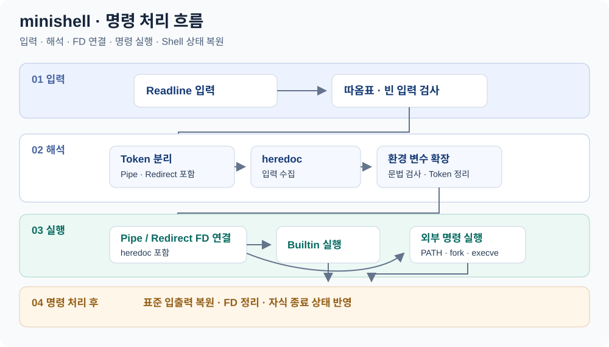

# minishell

C로 구현한 대화형 셸입니다. 입력한 명령을 토큰으로 나누고, 환경 변수를 확장한 뒤 내장 명령 또는 외부 프로그램을 실행합니다. 파이프와 입출력 리다이렉션, heredoc을 연결하면서 **프로세스·파일 디스크립터·종료 상태를 직접 관리**한 2인 팀 프로젝트입니다.

이 저장소는 [Minssc/minishell](https://github.com/Minssc/minishell)의 개인 보관본입니다.

## 명령 처리 흐름



입력 해석 단계는 `parse()`에서 Token을 만든 뒤 `heredoc_init()`, 환경 변수 확장, 문법 검사를 거칩니다. 실행 단계는 Redirect와 Pipe에 맞춰 파일 디스크립터를 연결한 뒤 Builtin 또는 외부 명령으로 분기하고, 한 명령 처리가 끝나면 표준 입출력을 복원합니다. 이 그림은 **팀 프로젝트 전체의 실행 흐름**이며, 개인 기여 범위는 아래 [협업과 기여](#협업과-기여)에서 별도로 구분합니다.

## 코드 구조

```text
.
├── sources/
│   ├── main.c        # Readline 입력과 명령 처리 루프
│   ├── token/        # 명령·인자·파이프·리다이렉션 토큰
│   ├── parse/        # 따옴표 처리, 환경 변수 확장, 토큰 정리
│   ├── builtin/      # 7개 내장 명령
│   ├── env/          # 환경 변수 목록과 execve용 배열
│   ├── exec/         # 명령 분기, PATH 탐색, fork·execve
│   ├── redir/        # 파일 입출력, 파이프, heredoc
│   ├── signal.c      # SIGINT·SIGQUIT 처리
│   └── fd.c          # 표준 입출력 복원과 FD 정리
├── bonus/            # 별도 빌드용 _bonus 소스
├── libft/            # 문자열·리스트 유틸리티
├── readline-master/  # 포함된 GNU Readline 8.1
└── Makefile
```

실행 흐름은 [main.c](sources/main.c) → [parse.c](sources/parse/parse.c) → [exec.c](sources/exec/exec.c) 순서로 읽을 수 있습니다.

## 주요 구현

| 영역 | 구현 내용 | 코드 |
| --- | --- | --- |
| 입력과 해석 | Readline 입력·히스토리, 작은따옴표·큰따옴표 처리, `$NAME`·`$?` 확장 | [parse/](sources/parse/), [token/](sources/token/) |
| 내장 명령 | `echo`, `cd`, `pwd`, `export`, `unset`, `env`, `exit` | [builtin/](sources/builtin/) |
| 외부 명령 | PATH에서 실행 파일 탐색, `fork`·`execve`, 자식 프로세스 종료 상태 수집 | [bin.c](sources/exec/bin.c), [bin_util.c](sources/exec/bin_util.c) |
| 입출력 연결 | 파이프와 `<`, `>`, `>>`를 파일 디스크립터와 `dup2`로 연결 | [redir.c](sources/redir/redir.c) |
| heredoc | `<<` 입력을 별도 자식 프로세스에서 수집하고 명령의 표준 입력으로 전달 | [heredoc.c](sources/redir/heredoc.c), [heredoc_util.c](sources/redir/heredoc_util.c) |
| 셸 상태 | 환경 변수 목록 유지, 명령 실행 후 표준 입출력 복원, SIGINT 처리 | [env/](sources/env/), [fd.c](sources/fd.c), [signal.c](sources/signal.c) |

내장 명령은 셸의 환경 변수와 작업 디렉터리를 갱신하고, 외부 명령은 환경 변수 목록을 배열로 변환해 `execve`에 전달합니다. heredoc은 별도 프로세스로 분리해 입력 도중 SIGINT가 발생하면 상태 130을 전달하도록 구성했습니다.

## 협업과 기여

| 참여자 | 주요 기여 | 이력 |
| --- | --- | --- |
| [tjung03](https://github.com/tjung03) | 7개 내장 명령 구현, `echo -n`·`exit` 예외 처리, `export +=` 추가와 오류 수정 | [내장 명령 PR #3](https://github.com/Minssc/minishell/pull/3), [명령 처리 보완 #12](https://github.com/Minssc/minishell/pull/12), [export 확장 #29](https://github.com/Minssc/minishell/pull/29) |
| [Minssc](https://github.com/Minssc) · minsunki | 셸 실행 코어와 파싱·메모리 정리, Readline 빌드 연결, heredoc 프로세스·시그널 처리 | [코어 정리 #7](https://github.com/Minssc/minishell/pull/7), [빌드 연결 #16](https://github.com/Minssc/minishell/pull/16), [heredoc #20](https://github.com/Minssc/minishell/pull/20), [파싱 보완 #27](https://github.com/Minssc/minishell/pull/27) |

각자 작업한 브랜치를 PR로 합쳤습니다. Minssc는 tjung03의 내장 명령 변경을 병합했고, tjung03은 Minssc의 Readline 빌드·heredoc·파싱 변경을 병합했습니다. 구현 이후에는 명령별 오류 처리와 메모리 정리를 함께 보완했습니다.

## 빌드와 사용

C 컴파일러, Make, 터미널 라이브러리(`-ltermcap`)가 필요합니다. [Makefile](Makefile)은 저장소에 포함된 **GNU Readline 8.1**을 configure한 뒤 정적 라이브러리로 빌드하고, libft와 함께 링크합니다.

```sh
git clone https://github.com/tjung03/minishell.git
cd minishell
make
./minishell
```

셸 프롬프트 안에서 다음 명령을 입력할 수 있습니다.

```sh
export PROJECT=mini
export PROJECT+=shell
echo "$PROJECT"
echo hello | wc -c
echo hello > output.txt
cat < output.txt
cat << END
hello from heredoc
END
exit
```

- `make bonus`도 같은 이름의 `minishell`을 생성합니다. 보너스 디렉터리는 [기본 구현을 복사한 이력](https://github.com/Minssc/minishell/pull/35)을 가진 별도 빌드 소스입니다.
- heredoc 파일은 실행 디렉터리의 `.minishell_heredoc_*`에 생성됩니다. 빌드·정리 타깃에서 이 파일들을 삭제합니다.
- `make clean`은 오브젝트를, `make fclean`은 실행 파일과 라이브러리 빌드 결과까지 정리합니다.
